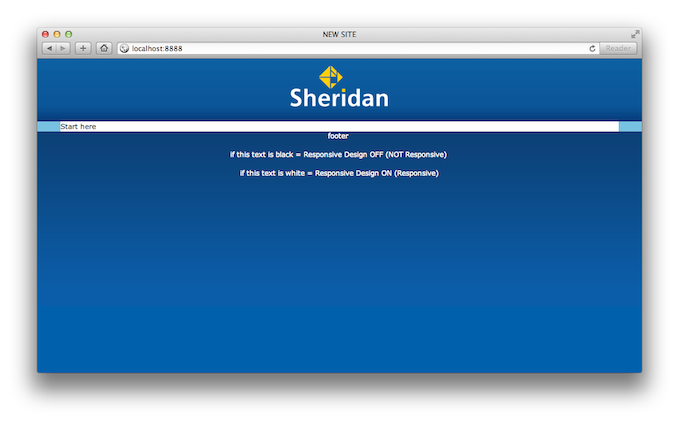

# Sheridan College Responsive Design Template

These files were designed to aid in the development of new pages for the Sheridan College website



## HTML/PHP

Files are designed to work off of a single `index.php` file where additional pages are created and then included with a PHP include automagically. It was created to avoid the redundancy of creating new files with a large header and footer. Pages are built in new PHP files without the clutter of a header or footer and then included dynamically. This makes the development process faster and easier.


### Structure

#### index.php

This file contains the header, footer, content elements and all HTTP requests to main stylesheets currently live on [SheridanCollege.ca](http://sheridancollege.ca) as if in a real production environment. The dynamic, automagic part is the following:

```php
<?php $page = $_GET['p'];
	if(!$page) {
		// Site Main Page
		include 'site.php';
	} else {
		// Additional pages
		include $page . '.php';
} ?>
```

In this file you can modify lines 11–22 to add in HTTP requests. jQuery and all default stylesheets and scripts are already included above this section.


##### Usage

1. Create a new file, e.g. `second_page.php`
2. In the navigation, link to this page like so: `<a href="/?p=second_page">Second Page</a>`

This will tell the `index.php` file to include the page with the value of `p` so it is important that they are identical.

If no value for `p` is specified, it defaults to `site.php` which is the first page of your site. Feel free to rename this file but if you do, you must replace the reference to it in the `index.php` with the new filename (line 34).


#### site.php

This is your main site file. You can change this filename to reflect the project name but be sure to make the change in the `index.php` file as well.

`site.php` contains:

```html
<div id="new_site">
	Start here
</div>
```

##### Usage

Build your site in this file alone and nest all elements in the `new_site` element. Please rename this element in both HTML and CSS files.


## CSS

All new Sheridan websites are built using the LESS CSS preprocessor and the [Semantic.gs](http://semantic.gs) grid system for efficient site development.

The Semantic.gs framework is found in `grid.less` and is imported in the new site's CSS:

`@import 'grid.less';`


### Responsive Design

New Sheridan webpages are built for the future. We anticipate a Responsive Design within the near future and are designing all new pages for Responsive Design.

Below is a copy of lines 28–38 in `new_site.less`:

```css
// RESPONSIVE DESIGN
// If Responsive, use, if not Responsive, comment out
//*----------- START HERE -----------*//
#content_bg {
	width: 100%;
	max-width: 960px; // This line is different in the site's IE stylesheet
}
#footer-sher {
	color: #fff;
	width: 100%;
	min-width: 100px;
	text-align: center;
}
//*----------- END HERE -----------*//
```

This will give designers and front-end developers the flexibility to design for the future while still designing for the present.

Line 48 of `new_site.less` reads:

```css
#new_site {
	// Nest new site CSS here
}
```

Nest all styles within this section so as not to accidentally override default styles site-wide in the event of a common class name and to ensure your styles are read as intended.

Do not forget about the `new_site-ie.less` stylesheet for Internet Explorer 8 and under.


## Javascript

Javascript file is empty except for document ready:

``` js
$(document).ready(function(){
	// New site scripts here
});
```